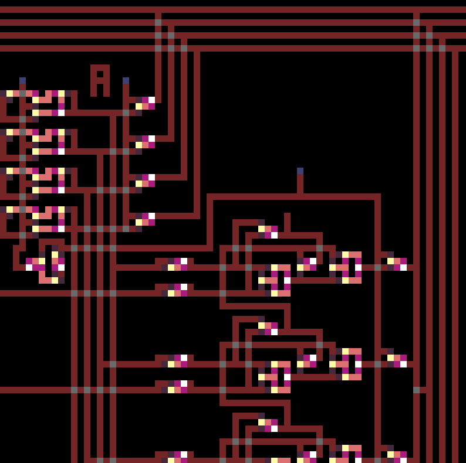

# logic-toy
Logic toy that only uses NAND gates.

Imports circuit.png and lets you play with switches.

| Color | Meaning |
| ------------- | ------------- |
| Red | Wire |
| Blue | Switch |
| White | NAND Gate |
| Purple | Gate Input |
| Grey | Wire Junction |
| Anything else | Ignored |

